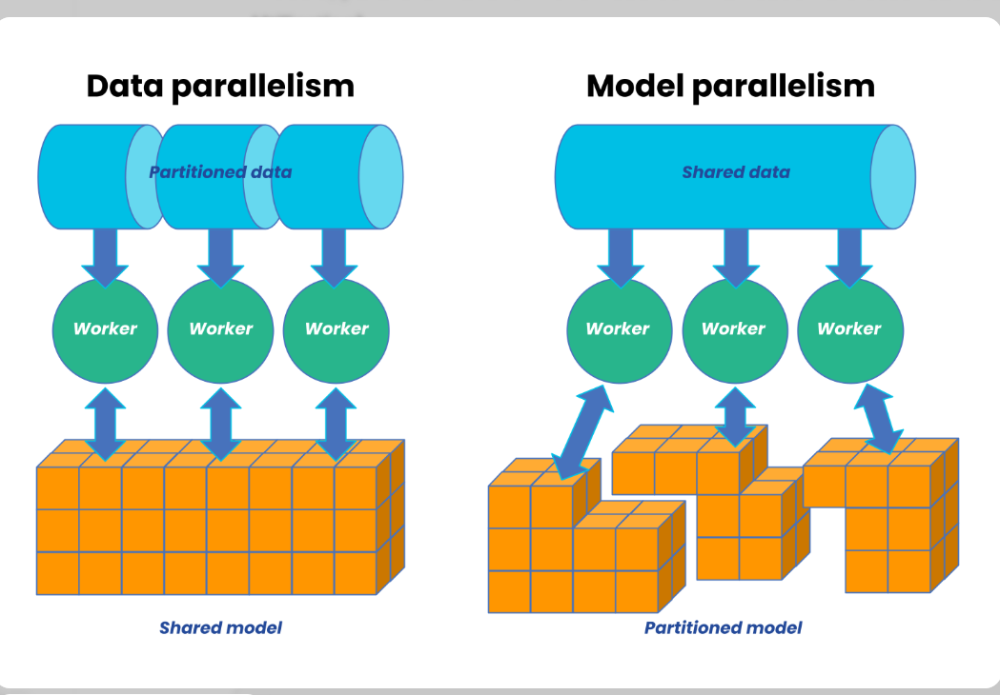
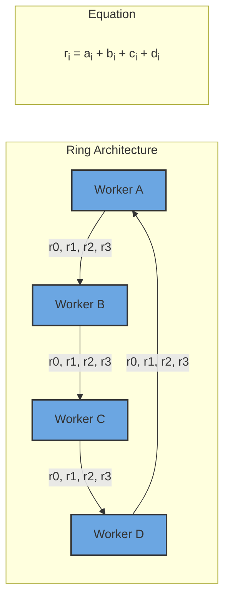
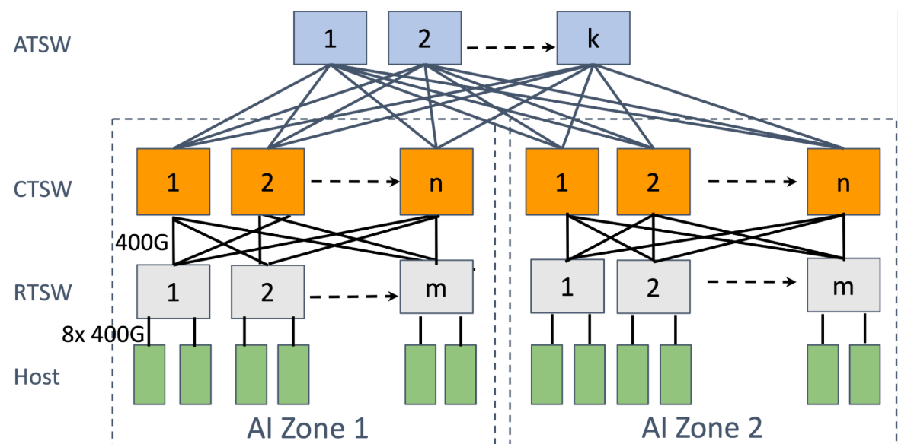
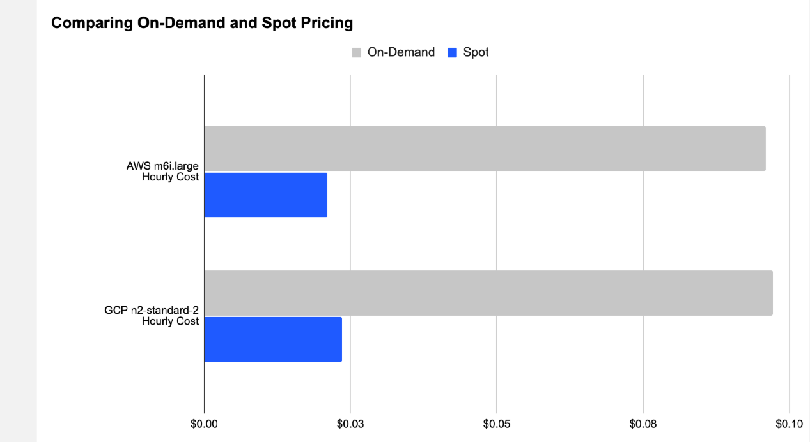

## Overview

The explosive growth of artificial intelligence, from large language models like GPT-4 to generative image systems like DALL-E, is often depicted as a triumph of algorithms and data. While these are crucial ingredients, the unsung hero of this revolution is the underlying AI infrastructure—the specialized hardware, software, and orchestration layers that transform mathematical models into functioning, scalable applications.

This piece explores the critical domain of AI Infrastructure and Compute Optimization. It moves beyond the model code to examine the foundational stack that makes modern AI possible. We define AI infrastructure as the integrated ecosystem of computational resources, data pipelines, networking, and software frameworks required to develop, train, deploy, and maintain AI systems at scale. Compute optimization is the discipline of maximizing the efficiency, speed, and cost-effectiveness of this infrastructure throughout the AI lifecycle.

The journey from a prototype to a production AI system is fraught with computational challenges:

**The Training Bottleneck:** Training state-of-the-art models can require thousands of specialized accelerators (GPUs, TPUs) running for weeks, consuming megawatts of power and millions of dollars.

**The Deployment Dilemma:** Serving these massive models to millions of users with low latency demands a completely different optimization profile than training.

**The Resource Scarcity:** With global demand for AI compute far outstripping supply, simply throwing more hardware at the problem is neither feasible nor economical.

Therefore, optimization is no longer a niche concern; it is a core business imperative. This involves a multi-layered approach:

(1). **Hardware Efficiency:** Leveraging specialized chips (GPUs, TPUs, NPUs) and understanding their memory hierarchies, interconnect technologies (NVLink, InfiniBand), and optimal configuration.

(2). **Software Orchestration:** Utilizing frameworks (PyTorch, TensorFlow), compilers (XLA, OpenAI Triton), and kernels to ensure hardware is fully saturated with minimal idle time.

(3). **Systems Architecture:** Designing scalable, fault-tolerant clusters for distributed training and inference, often across hybrid cloud environments.

 (4). **Algorithmic & Model-Level Optimization:** Techniques like mixed-precision training, model pruning, quantization, and distillation that drastically reduce computational load without proportional losses in accuracy.

**Intended Audience**

This piece is designed for technical professionals, decision-makers, and enthusiasts who are involved in building, deploying, or managing AI systems and need to understand the infrastructure that powers them.

(1). **ML Engineers & AI Researchers:** Practitioners who write model code and face the direct challenges of long training times, out-of-memory errors, and slow iteration cycles. They will gain insights into how to structure their workloads and leverage tools to maximize the productivity of their compute resources, moving faster from research to production.

(2). **Infrastructure & DevOps Engineers:** Professionals responsible for provisioning, maintaining, and scaling the clusters and cloud environments where AI workloads run. This content will help them understand the unique demands of AI workloads (vs. traditional web services) and guide the design of robust, efficient, and cost-effective platforms for their data science teams.

(3). **Technical Leaders & Architects:** CTOs, VPs of Engineering, and Solutions Architects who make strategic decisions about technology investments, cloud strategy, and platform choices. This overview will equip them with the framework to evaluate infrastructure trade-offs, plan for scale, and align compute strategy with organizational AI goals.

(4). **Cloud & Hardware Enthusiasts:** Individuals keen on understanding the cutting-edge developments in accelerated computing, interconnect technology, and how cloud providers (AWS, Google Cloud, Azure) are structuring their AI/ML service offerings.

(5). **Product Managers for AI-Powered Products:** PMs who need to understand the infrastructural constraints and costs that influence model capabilities, deployment feasibility, latency, and ultimately, user experience and roadmap planning.

**Prerequisite Knowledge:** The article assumes a foundational understanding of what machine learning and deep learning are, and a high-level familiarity with concepts like neural network training and inference. It does not require expert-level hardware or systems knowledge, as it aims to build that bridge from first principles to current best practices.

### 1.1 Basics of Artificial Intelligence workload

**AI Workloads: The Fundamental Dichotomy of Training vs. Inference**

Understanding the distinction between training and inference is the essential first step in designing efficient AI infrastructure. These two phases represent fundamentally different computational challenges, each with unique performance characteristics, resource requirements, and optimization strategies.

**The Two Pillars of the AI Lifecycle**

(1). **Training**
Training is the process of creating the AI model itself—teaching it patterns from data. 

**What happens**

A model's architecture ( a neural network with millions or billions of parameters) is initialized, typically with random values.

The model is fed massive volumes of labeled data (like images with descriptions, text sequences, game states).

Through iterative optimization (primarily backpropagation), the model's internal parameters are adjusted to minimize a loss function—the difference between its predictions and the correct answers.

This process runs continuously for hours, days, or even weeks until the model achieves satisfactory accuracy.

***Key characteristics**
Compute-Intensive: Requires immense, sustained computational power, primarily floating-point matrix operations.

**Batch-Oriented:** Processes huge batches of data in parallel to compute stable gradient updates.

**Stateful & Iterative:** Maintains the evolving state of the model parameters across thousands or millions of iterations.

**High-Precision:** Typically uses 32-bit (FP32) or mixed 16/32-bit (FP16/BF16) precision to ensure stable convergence.

**Cluster-Scale:** Often distributed across hundreds or thousands of accelerators (GPUs/TPUs) working in concert.

(2). **Inference**
Inference is the process of using a trained model to make predictions on new, unseen data. 

**What Happens:**

A trained, fixed model (its parameters are now frozen) receives an input (e.g., a user's prompt, a new image, a sensor reading).

The model performs a forward pass through its network to produce an output (e.g., generated text, a classification, a forecast).

The result is returned to the user or application.

**Key Characteristics:**

**Latency-Sensitive:** Often needs to meet strict response-time Service Level Objectives (SLOs), especially for interactive applications (e.g., chatbots, real-time recommendations).

**High-Throughput:** May need to serve millions of requests per second globally (e.g., spam detection, photo tagging).

**Stateless:** The model parameters do not change; each request is independent.

**Precision-Optimized:** Often uses lower precision (INT8, FP16) to speed up computation and reduce memory usage without significant accuracy loss.

**Cost-Efficient:** Must run continuously 24/7; operational cost and energy efficiency become primary concerns.

| Aspect | Training Workloads | Inference Workloads |
|------|-------------------|--------------------|
| **Primary Goal** | Accuracy / Convergence | Latency & Throughput |
| **Compute Pattern** | Long-running, batch-parallel, communication-heavy | Short-burst, request-parallel, communication-light |
| **Hardware Focus** | Peak FLOPs & High-Bandwidth Interconnects | Memory Bandwidth, Low-Latency I/O, & Energy Efficiency |
| **Critical Metric** | Time-to-Train (e.g., hours to train GPT-4) | P99 Latency & Queries Per Second (QPS) per Dollar |
| **Precision** | FP32, Mixed (FP16/BF16) for stability | INT8, FP16, sometimes FP32 for sensitive tasks |
| **Scale** | Large, expensive clusters used intermittently | Many smaller, distributed deployments, running constantly |
| **Failure Tolerance** | Checkpointing; can restart from last save | Must be highly available; failures directly impact users |

**Training is a scientific endeavor; inference is an engineering one.**
You build infrastructure once for a training run, but you build it for resilience and scale for inference.

This dichotomy informs every subsequent decision in AI infrastructure:

You cannot design a cost-effective inference system using the same principles as your training cluster.

Purchasing decisions, cloud vendor choices, and software frameworks must align with which phase you are optimizing for.

The emerging practice of MLOps is largely about managing the transition between these two worlds—taking a model from the experimental, training-focused environment to a stable, scalable, inference-serving production system.

**Why is AI compute intensive?**

Modern AI is computationally intensive due to its core nature and the pursuit of unprecedented capability. Fundamentally, deep learning performs trillions of matrix multiplications across neural networks with billions to trillions of parameters. This scale is driven by empirical Scaling Laws, which show that model performance directly correlates with model size, dataset size, and compute used for training, creating an inevitable race toward larger models.

The dominant transformer architecture compounds this with quadratic computational complexity for its attention mechanism, making longer context windows exponentially more expensive. Furthermore, the iterative process of training requires processing massive datasets multiple times, performing forward passes, backward propagation, and optimizer updates.

A critical bottleneck is the **"memory wall."** Moving model weights and data between GPU memory, system RAM, and storage is vastly slower than the computation itself, often leaving powerful processors idle while waiting for data.

**Difference between traditional software workloads and AI workloads**

Modern AI represents a paradigm shift in computing, demanding entirely new infrastructure approaches. At its core, AI splits into two distinct phases with divergent requirements: Training (the compute-intensive, stateful "learning" phase) and Inference (the latency-sensitive, stateless "application" phase). Training consumes weeks of specialized cluster time to iteratively adjust billions of parameters, while inference serves predictions at scale, where cost-per-query and response time are critical.

The astronomical compute demands stem from fundamental factors: AI executes massively parallel matrix operations across neural networks with billions of parameters, governed by empirical scaling laws that show capability grows predictably with compute investment. The transformer architecture's quadratic attention complexity and the relentless "memory wall"—where moving data between storage and compute cores becomes the primary bottleneck—compound this intensity. Unlike traditional software, AI workloads are statistical, hardware-specific, and computationally bound, requiring specialized accelerators (GPUs/TPUs) rather than general-purpose CPUs.

This creates a stark contrast with traditional enterprise workloads. Where conventional software is I/O-bound, predictable, and horizontally scalable, AI is compute-bound, probabilistic, and requires monolithic scaling for training. The infrastructure mindset must shift from maximizing general cluster utilization to maximizing accelerator saturation and minimizing data movement. Performance metrics evolve from request latency to time-to-train and tokens-per-second-per-dollar.

Optimization therefore operates on three fronts:

(a). **Hardware:** Matching specialized chips (H100s for training, Inferentia for inference) to their ideal workloads.

(b). **Software:** Using kernel fusion, mixed precision training, and model quantization to reduce computational and memory overhead.

(c). **Systems:** Designing distributed training strategies (data/model parallelism) and inference serving systems with dynamic batching.

**Data Parallel and Model Parallel computation**

| Aspect | Data-Parallel | Model-Parallel |
|------|--------------|----------------|
| **What’s Split** | Data (batches) | Model (layers / tensors) |
| **What’s Copied** | Full model on each device | Data batch to all devices |
| **Communication** | Gradient synchronization (All-Reduce) | Activation passing between devices |
| **When Used** | Model fits in single GPU memory | Model too large for single GPU |
| **Scaling Limit** | Batch size & gradient sync overhead | Pipeline “bubbles” & communication latency |
| **Complexity** | Lower – easier to implement | Higher – requires careful partitioning |

**How they work**

**Data parallel**

[Batch of 64] → Split → [GPU1: 16 samples] → Compute Gradients
                         [GPU2: 16 samples] → Compute Gradients  
                         [GPU3: 16 samples] → Compute Gradients
                         [GPU4: 16 samples] → Compute Gradients
                                         ↓
                                Average Gradients (All-Reduce)
                                         ↓
                               Update All Model Copies Together

**Each GPU:** Has complete model copy + different data slice

**Sync point:** Gradients averaged after each iteration

**Best for:** CNN, BERT-sized models (single GPU memory)

**Model parallelism**

**Two Main Types:**

1. Pipeline Parallel (Vertical Split):
   GPU1: Layers 1-4   → GPU2: Layers 5-8   → GPU3: Layers 9-12
   [Batch 1] →           →           → Output
   [Batch 2] → [Bubble] →           → Output  ← Idle time!
   [Batch 3] →           → [Bubble] → Output  ← More idle time!

2. Tensor Parallel (Horizontal Split):
   GPU1: First half of layer computation
   GPU2: Second half of layer computation
        ↓
   Sync activations after EACH layer operation

### 1.2 Fundamentals of computing infrastructure

**What "compute" means in AI.**

"Compute" in AI refers to the specialized hardware and mathematical capacity required to train and run neural networks—specifically the ability to perform massive parallel matrix operations efficiently. Unlike general computing, AI compute prioritizes throughput over latency and requires hardware fundamentally different from traditional CPUs.

**Core hardware comparison**

| Hardware Type | Primary Strength | AI Role | Key Limitation | Best For |
|--------------|----------------|--------|----------------|----------|
| **CPU** | Complex logic, versatility | Controller, data prep | Poor parallelism | Light inference, orchestration |
| **GPU** | Massive parallelism | AI workhorse | Power consumption | Training & flexible inference |
| **TPU** | Matrix math efficiency | Google ecosystem | Software lock-in | TensorFlow workloads |
| **AI ASICs** | Specialized efficiency | Task-specific acceleration | Inflexibility | High-volume inference |

**The memory hierarchy- the true bottleneck** 
AI compute isn't just about calculations—it's about moving data efficiently through a memory pyramid:

[Slowest/Largest]          [Fastest/Smallest]
   ↓                              ↓
Storage (PB)                    ↓
   ↓                    On-Chip Cache (MB)
System RAM (TB)                ↓
   ↓                    GPU Memory (GB)    ← BOTTLENECK!
PCIe Bus                       ↓
   ↓                    Compute Cores
Data Movement > Computation

**Memory Bandwidth Reality Check:**
CPU DDR5 RAM: ~100 GB/s

PCIe 5.0 (CPU↔GPU link): ~128 GB/s ← Choke point!

NVIDIA H100 HBM3: 3.35 TB/s (33× CPU speed)

Google TPU v4: 1.2 TB/s chip-to-chip

**Why traditional CPUs fail at AI**

CPUs are optimized for sequential, branch-heavy code—exactly what AI isn't:

| CPU Design | AI Workload Reality | Mismatch Impact |
|------------|-------------------|----------------|
| **Few cores (8-64)** | Needs 1000s of parallel ops | < utilization |
| **Complex control logic** | Predictable data flow | Wasted silicon |
| **Optimized for latency** | Needs throughput | Poor efficiency |
| **General-purpose** | Highly specialized | Energy inefficient |

A GPU's 10,000+ simple cores executing the same instruction on different data (SIMD) matches AI's mathematical regularity perfectly.

AI compute has evolved from "anything that runs code" to highly specialized hardware ecosystems optimized for matrix mathematics. Success requires matching:

**Hardware architecture to workload characteristics**

**Memory hierarchy to model size**

**Software ecosystem to team expertise**

**Deployment model to economic constraints**

The future belongs not to the fastest individual chip, but to the most cohesive hardware-software stack that minimizes data movement, maximizes utilization, and provides predictable scaling from prototype to planetary deployment.

**Memory hierarchy:AI data pathway**

The memory hierarchy is a tiered system that balances speed, capacity, and cost. For AI, managing this hierarchy is the primary performance challenge.

**Fastest/Smallest/Expensive → Slowest/Largest/Cheapest**

**Registers (KB):** Inside the processor. 1 cycle access. Holds data being computed right now.

**Cache (MB):** On-chip SRAM. L1/L2/L3, ~10-100 cycles. Holds recent/frequent data (model weights, activations).

**RAM/VRAM (GB/TB):** System/GPU memory. ~100-500 cycles. Holds the working set: full model, batches, gradients. Bottleneck for AI—must feed the compute cores fast enough.

**Storage (TB/PB):** SSD/HDD/NAS. ~10,000+ cycles. Holds datasets, checkpoints, model archives.

**The Core Problem in AI:** The Memory Wall
Compute cores are thousands of times faster than fetching data from RAM. A GPU tensor core can perform an operation in nanoseconds but may wait microseconds for weights to arrive.

**AI-Specific Challenge:**

**Training:** Must fit model + optimizer states + activations in fast memory (GPU VRAM) or performance crashes.

**Inference:** Latency dominated by loading weights from VRAM to registers. Larger models that don't fit in VRAM must swap from slower RAM (via PCIe), killing speed.

**Solution Focus:** Minimize movement up the hierarchy. AI chip design focuses on massive bandwidth (HBM).

**Storage Types for AI**

Storage is the slowest tier in the memory hierarchy but holds the massive datasets and model checkpoints for AI. Choosing the right type directly impacts training throughput and cost.

| Type | Speed | Best for AI | Key Limitation |
|------|-------|------------|----------------|
| **HDD (Hard Disk Drive)** | Slow (100–200 MB/s) | Cold storage for archived datasets and logs | High latency, poor random access |
| **SSD SATA (Solid State Drive)** | Moderate (500–600 MB/s) | Active datasets and frequent checkpoints | SATA bus bottleneck |
| **NVMe SSD (Non-Volatile Memory Express)** | Fast (3–7 GB/s) | High-performance training pipelines | Higher cost per TB |
| **NVMe over Fabrics (NVMe-oF)** | Extreme (network-speed) | Multi-node training with shared storage | Complex setup, expensive |

**For AI Workloads:**

**Training:** Use NVMe SSDs for your active dataset drive. Sequential reads of training files benefit massively from NVMe speed.

**Checkpointing:** NVMe or fast SATA SSD to minimize the time GPUs sit idle while saving model state.

**Archival:** HDD arrays for cost-effective petabyte-scale storage of raw data and old model versions.

Evaluating AI compute requires metrics beyond traditional computing benchmarks. Here are the critical measures that determine real-world performance and efficiency.

### 3 Computer architecture for AI

This section examines the specialized hardware that powers modern AI workloads. Today, the landscape emphasizes massive parallelism, ultra-high-bandwidth memory (HBM), low-precision compute for efficiency, and tight interconnects to overcome the memory wall and enable exascale-scale training and low-latency inference.

### 2.1 CPU Architecture

**Role of CPUs in AI systems**

CPUs serve as orchestrators rather than primary compute engines. They handle data preprocessing, I/O coordination, control flow, scheduling, and lightweight inference tasks. In AI clusters, CPUs manage OS-level operations, network communication, and coordination between accelerators.

**SIMD, multithreading, and vectorization**

Modern CPUs leverage SIMD (Single Instruction, Multiple Data) via AVX-512 or AMX instructions, enabling vectorized operations on small batches or non-matrix workloads. Multithreading (via many cores and hyper-threading) supports concurrent data loading and preprocessing. Vectorization accelerates element-wise operations, but limited core counts and lower parallelism restrict CPUs to auxiliary roles.

**CPU bottlenecks in AI workloads**

CPUs suffer from few cores (typically 64–128), complex branch-heavy logic, and lower memory bandwidth (~100–200 GB/s DDR5). They deliver poor utilization on matrix-heavy AI tasks, leading to energy inefficiency and idle time. The mismatch with AI's predictable, throughput-oriented nature makes general-purpose CPUs unsuitable as primary accelerators.

2.2 **GPU Architecture**

**Why GPUs dominate AI**

GPUs excel due to thousands of simple cores executing SIMD instructions in lockstep, perfectly matching AI's regular matrix multiplications and massive parallelism. They provide high throughput for training and flexible inference, with mature ecosystems (CUDA, ROCm).

**CUDA cores, tensor cores**

CUDA cores handle general-purpose parallel compute (FP32/FP64).
Tensor Cores are specialized matrix units for accelerated deep learning. In NVIDIA's Blackwell architecture (dominant in 2026), fifth-generation Tensor Cores support FP4, FP6, FP8, and NVFP4 formats, delivering massive gains: e.g., B200 offers ~9–18 PFLOPS FP4 (dense/sparse), with 2× attention acceleration and micro-tensor scaling via the second-generation Transformer Engine.

**GPU memory (HBM, VRAM)**

High-Bandwidth Memory (HBM3e) is critical. Blackwell GPUs feature 192 GB HBM3e per B200 (up to 8 TB/s bandwidth), far surpassing Hopper's H100/H200 (~3.35–4.8 TB/s). This addresses the memory wall by feeding tensor cores rapidly, enabling larger models/batches without excessive swapping.

**GPU scheduling and parallelism**
GPUs use massive thread-level parallelism (warps of 32 threads) and streaming multiprocessors (SMs) for concurrent execution. Features like cooperative groups, warp-level primitives, and MIG (Multi-Instance GPU) enable efficient partitioning. NVLink 5 and NVSwitch provide ultra-high interconnect bandwidth (e.g., 130 TB/s domains in NVL72 racks), minimizing communication overhead in multi-GPU setups.

2.3 **AI Accelerators**
**TPUs and NPUs**

**TPUs :** Systolic arrays optimized for matrix multiply. TPU v5p delivers ~459 TFLOPS BF16 per chip (95 GB HBM2e, 2.765 TB/s). Newer generations like TPU v7 (Ironwood) reach ~4,614 TFLOPS BF16/FP8, 192 GB memory, and ~7.37 TB/s bandwidth, excelling in Google's ecosystem for training and inference.

***NPUs (Neural Processing Units):** Integrated in client/edge devices (e.g., Intel Core Ultra, AMD Ryzen AI, Qualcomm) for efficient on-device inference. They focus on low-power, quantized workloads (INT8/FP16).

**ASICs for AI**

Application-Specific Integrated Circuits deliver peak efficiency for fixed workloads. Examples:

Groq LPUs for ultra-low-latency inference (~185 tok/s, sub-ms TTFB).
Cerebras WSE-3 (wafer-scale) for massive on-chip memory and fast trillion-parameter training.
AWS Trainium/Inferentia, Tenstorrent, SambaNova RDUs, and Etched transformers target specific domains (e.g., inference efficiency, reconfigurable dataflow).
ASICs trade flexibility for 5–30× better perf/W or latency vs. GPUs in targeted scenarios.

**FPGA-based acceleration**

FPGAs offer reprogrammability for custom datapaths (e.g., low-precision inference, sparse tensors). AMD (Xilinx) Versal and Intel Agilex/Stratix families integrate AI engines for adaptive acceleration in data centers, edge, and automotive. They suit dynamic workloads or when full ASIC redesign is impractical, though they lag GPUs/ASICs in raw throughput for standard transformers.

2.4 **Memory Architecture**
Memory architecture is the dominant factor in AI performance as of February 2026. The "memory wall" persists: compute capabilities (FLOPS) have scaled dramatically, but memory bandwidth and capacity improvements lag, leaving accelerators memory-bound for most deep learning workloads—especially inference and large-model training. The roofline model illustrates this: performance is capped by the minimum of peak compute and (bandwidth × arithmetic intensity). Low arithmetic intensity (operations per byte moved) pushes workloads into the memory-bound region, where extra FLOPS yield no gains.

**Cache coherence**

Cache coherence ensures consistent views of shared data across caches in multi-processor systems. In single-GPU setups, intra-GPU coherence (L1/L2 caches) is hardware-managed. In multi-GPU clusters:

NVIDIA NVLink (Gen 5/6 in Blackwell/Rubin) and NVLink-C2C provide hardware cache coherence for GPU-GPU and CPU-GPU sharing.
This enables coherent unified address spaces (e.g., Grace-Blackwell Superchip treats LPDDR and HBM as one coherent pool).
Benefits include direct load/store across devices, reduced explicit transfers, and atomic operations without software overhead.
Trade-off: coherence traffic consumes interconnect bandwidth; protocols optimize via directories and snoop filters.

**Unified memory**

Unified memory (CUDA-managed) creates a single virtual address space accessible from CPU and GPU, with runtime handling page migrations via faults.

**Emerging:** Extended GPU memory pools (e.g., via NVLink fabrics) allow addressing terabytes coherently.

**Memory bottlenecks in deep learning**

**The memory wall dominates:**

Training: Model parameters, activations, gradients, and optimizer states exceed fast memory (HBM), forcing spills to slower system RAM/PCIe/storage → idle compute cores.
Inference (decode phase): Low arithmetic intensity (~1–10 FLOPs/byte for autoregressive generation); KV cache and weights dominate bandwidth demand. Per-token latency is often HBM-bound, not compute-bound.
Current accelerators: NVIDIA Blackwell B200/B300 (192–288 GB HBM3e, ~8 TB/s bandwidth), Google TPU v7/Ironwood (~192 GB, ~7.37 TB/s), but even these saturate on frontier models (trillions of parameters, long contexts). HBM supply/packaging remains a systemic constraint.

**Compute-to-memory ratio**

Also called arithmetic intensity or operational intensity (FLOPs/byte moved from memory).

High ratio → compute-bound (ideal for peak FLOPS utilization).
Low ratio → memory-bound (roofline knee shifts right as compute grows faster than bandwidth).
In transformers: GEMM operations achieve high intensity; attention and decode phases drop low (quadratic attention but linear KV cache access).
2026 reality: Many AI workloads fall below 100–500 FLOPs/byte thresholds needed to saturate modern HBM → emphasis shifts to bandwidth, larger on-chip caches (e.g., Blackwell's expanded L2), kernel fusion, and prefetching over raw FLOPS.
Mitigation: Quantization (FP4/FP8/NVFP4), sparsity, larger HBM stacks, and coherent multi-chip fabrics to boost effective intensity.

### 3 Operating System and system: The foundation of AI compute optimization

operating systems and systems software form the critical foundation where compute optimization truly begins. This layer transforms raw hardware into a predictable, efficient platform for AI workloads, managing the complex interplay between parallel computations, memory hierarchies, and I/O patterns that define modern machine learning.

**The Multifaceted Role of the Operating System in AI**

**Thread Management:** The OS must efficiently manage hundreds of framework threads, using CPU pinning to bind critical threads to dedicated cores. This prevents oversubscription and cache thrashing for key operations like gradient synchronization.

**Memory Management:** The OS must minimize swapping and fragmentation for massive model weights and datasets. Using huge pages (2MB/1GB) instead of 4KB pages drastically reduces TLB misses. This requires coordination with GPU memory allocators to prevent fragmentation.

**I/O Handling:** AI training has unique I/O patterns: sequential reads of datasets and burst writes of large checkpoints. The OS scheduler must optimize read-ahead caching for data and prioritize low-latency writes. The page cache must be carefully sized to balance data loading and memory for model weights.

**Linux**

**Why Linux Dominates AI Infrastructure**

Linux’s near-total dominance in AI data centers comes down to control, performance, and scalability at the systems level.

**1. Kernel-Level Control**

Linux allows deep customization that proprietary OSes don’t:

Kernel tuning for AI workloads (scheduler behavior, I/O paths)

Zero-copy data movement (mmap, direct I/O) to remove data-loading bottlenecks

Fine-grained scheduling control for latency-sensitive training and communication tasks

**2. NUMA and Hardware Topology Awareness**

Modern AI servers are NUMA systems:

Linux provides explicit NUMA control (numactl, NUMA-aware allocators)

Memory and CPU affinity reduce cross-node latency (often 2–3× slower otherwise)

Critical for GPU workloads: bind CPUs, memory, and GPUs based on PCIe/NVLink topology

**3. GPU-Optimized Kernels and I/O**

Production AI systems rely on Linux variants with:

High-performance async I/O (io_uring)

GPU-aware scheduling and memory management

Stable handling of GPU memory pressure and oversubscription

**4. Containers and Resource Isolation**

Linux primitives power all AI container platforms:

cgroups and namespaces enable isolation of CPU, memory, and I/O

Essential for multi-tenant training clusters

High-performance setups minimize virtualization overhead (bare-metal containers, lightweight runtimes)

**The Final 10–20%: Precision Resource Management**

This is where good systems become great.

**CPU Isolation and Pinning**

Dedicated cores for training, data loading, and communication threads

isolcpus, cpuset, taskset eliminate scheduler jitter

Enables predictable, low-latency synchronization

**GPU-Aware Scheduling**

Allocation based on NVLink and PCIe topology

Fractional GPU sharing where appropriate (MIG, vGPU)

Automated discovery and scheduling in production clusters

**Intelligent Memory Management**

Avoid naive memory caps that trigger OOM kills

Separate working memory from transient buffers (e.g., checkpoints)

Spill to fast storage instead of crashing under pressure

**Power and Thermal Control**

Dynamic frequency scaling aligned with workload phases

Proactive thermal management avoids throttling

Small per-node gains compound massively at scale

AI performance isn’t decided by models or hardware alone.
The OS is a performance multiplier.

**Linux enables:**

Higher utilization

Predictable latency

Lower operational cost at scale

At cluster sizes where GPUs cost millions, even single-digit efficiency gains matter. That’s why elite AI teams treat systems software as a first-class discipline, not an afterthought.

### 4. AI Frameworks & Runtime Systems

This section bridges software abstractions to hardware acceleration. Modern deep learning frameworks define models and control execution, while runtime systems and compilers optimize the compute graph for efficient mapping to GPUs, TPUs, and other accelerators—critical for saturating hardware and minimizing idle time.

### 4.1 Deep Learning Frameworks

**TensorFlow architecture**

TensorFlow uses a dataflow graph model where computations are nodes (operations) and edges are tensors. It supports both eager execution (default since TF 2.x for intuitive debugging) and graph mode (via tf.function or tf.Graph for optimization). Keras provides a high-level API for rapid model building. The runtime compiles graphs for distributed execution across CPUs, GPUs, and TPUs, with strong production focus on scalability and deployment.

**PyTorch execution model**

PyTorch defaults to eager execution: operations execute immediately as Python code runs, building the computation graph dynamically ("define-by-run"). This enables natural debugging, dynamic control flow, and rapid prototyping. For production, torch.compile or TorchScript converts code to an optimized graph, enabling fusions and kernel specialization.

# Static vs Dynamic Computation Graphs

| **Aspect** | **Static Graphs** (e.g., TensorFlow graph mode, TorchScript) | **Dynamic Graphs** (e.g., PyTorch eager, TF 2.x eager) |
|------------|------------------------------------------------------------|-------------------------------------------------------|
| **Definition** | **Define-then-run**: Graph built upfront, then executed | **Define-by-run**: Graph built on-the-fly during execution |
| **Flexibility** | **Lower**; fixed structure, harder for variable inputs/control flow | **Higher**; supports dynamic shapes, loops, conditionals natively |
| **Debugging** | **More complex** (requires tracing compiled graph) | **Easier** (standard Python debugging tools) |
| **Optimization Potential** | **Higher**: Full-graph view enables aggressive fusions, constant folding | **Good with compilation** (e.g., torch.compile); runtime overhead otherwise |
| **Performance** | **Typically faster in production** after compilation | **Competitive with modern compilers**; eager can be slower without optimization |
| **Use Case** | **Deployment, large-scale training/inference** | **Research, prototyping, dynamic models** |

4.2 **Compute Graph Optimization**

These techniques reduce kernel launches, memory traffic, and redundant computation by transforming the graph before hardware execution.

**Operator fusion** — Combines sequential ops (e.g., Conv + BatchNorm + ReLU) into a single kernel, eliminating intermediate tensor materialization and reducing memory bandwidth pressure.

**Kernel optimization** — Custom or auto-tuned kernels (via Triton, CUTLASS) maximize hardware utilization; includes tiling, vectorization, and precision-specific implementations.

**Graph pruning** — Removes redundant nodes, constant folding, dead-code elimination, and shape inference to simplify the graph.

**Lazy vs eager execution — Eager:** immediate op dispatch (flexible but higher overhead). Lazy: defers execution to build full graph for holistic optimization (e.g., via torch.compile or XLA), enabling fusions and better scheduling.

4.3 **Runtime Systems**

**CUDA runtime**

NVIDIA's low-level API for GPU programming. Manages memory allocation, kernel launches, streams, and events. Frameworks like PyTorch and TensorFlow use it under the hood for direct GPU control; torch.cuda or tf.device provide abstractions.

**XLA (Accelerated Linear Algebra)**

Google's open-source domain-specific compiler (part of OpenXLA) that takes graphs from TensorFlow, JAX, or PyTorch (via torch_xla) and generates optimized kernels for CPUs, GPUs, and TPUs. It performs aggressive fusions, layout optimizations, and hardware-specific codegen, often yielding 20–50% speedups on matrix-heavy workloads.

**ONNX Runtime**

Cross-framework inference engine for ONNX models (exported from PyTorch, TensorFlow, etc.). Applies graph optimizations (fusion, constant folding), quantization, and execution providers (EPs) for hardware acceleration (CUDA, TensorRT, DirectML, etc.). Supports training acceleration and model compression for efficient deployment.

**TensorRT**

NVIDIA's high-performance inference SDK. Converts models (via ONNX or direct import) into optimized engines with layer fusion, precision calibration (FP16/INT8/FP8), dynamic shapes, and KV-cache optimizations for transformers. Excels in low-latency, high-throughput serving on GPUs, especially for LLMs.

### 5. Data Pipelines & Input Optimization

Many large-scale AI training jobs are bottlenecked by data input rather than GPU compute. Underutilized GPUs (often less than 30% utilization) signal that the system is starved for data, not compute-limited. Optimizing the data pipeline is usually the highest-leverage fix.

**5.1 Data Loading Bottlenecks**

**I/O vs compute imbalance**

Modern GPUs process batches in milliseconds, but loading and preprocessing a batch from storage can take seconds. This creates a pipeline where compute is idle waiting for I/O. The classic symptom is GPU utilization dropping sharply during training epochs while CPU and disk/network activity spike. The effective throughput is limited by the slowest stage.

**Disk vs network bottlenecks**

Local NVMe SSDs deliver 3–7 GB/s sequential reads, but many training jobs use network-attached storage.

**Local disk:** Fast (low latency, high bandwidth), but capacity is limited and scaling across nodes is hard.

**Network storage:** Object stores (S3) or distributed file systems introduce 10–100× higher latency and 5–50× lower bandwidth per client. Even with 100 Gbps links, effective throughput per node often falls to 100–500 MB/s due to protocol overhead, contention, and small-object reads.

**5.2 Data Pipeline Optimization**

**Prefetching**

Overlap data loading with model computation. Frameworks like PyTorch DataLoader `(num_workers > 0, prefetch_factor > 1)` and TensorFlow `tf.data (prefetch)` automatically load the next batch while the current batch is being processed. Effective prefetch depth is usually 2–4 batches.

**Caching**

Keep hot datasets in memory or fast local storage.

In-memory caching (RAM): Ideal for small-to-medium datasets (< GPU memory × nodes).
Local SSD caching: Use tools like Alluxio, JuiceFS, or PyTorch torch.utils.data.dataset.Dataset with custom caching.
Persistent caching layers (e.g., Redis, Memcached) for shared datasets across jobs.

**Parallel data loaders**

Use multiple worker processes/threads to saturate I/O bandwidth.

PyTorch: num_workers=8–32 (rule of thumb: 4–8 per GPU).
TensorFlow: `tf.data with num_parallel_calls=AUTOTUNE` and `interleave`.
Watch for memory thrashing and CPU contention—profile with `nvidia-smi`, `htop`, and `iotop`.

**Compression strategies**

Reduce I/O volume at the cost of CPU cycles for decompression.

On-disk: Zstandard (zstd), Blosc, or LZ4—fast decompression, good ratios (2–4×).
In-flight: Use compressed formats (WebDataset shards with tar + zstd, TFRecord with gzip).
Trade-off: Compression ratio vs decompression throughput. Zstd level 3–5 is often optimal for training.

**5.3 Storage Systems for AI**

**Object storage**

S3-compatible (AWS S3, GCS, MinIO, Ceph).
Pros: Virtually unlimited scale, durability, pay-for-use.
Cons: High first-byte latency (10–100 ms), lower throughput per connection, small-object penalty.
Best for: Cold/archival data, multi-region access, or when using sharded formats (WebDataset, TFRecord) with prefetching.

**Distributed file systems**

Lustre, BeeGFS, WEKA, VAST, HDFS, or GPFS.
Pros: High aggregate bandwidth (10–100 GB/s per node), POSIX compatibility, low latency for small reads.
Cons: Expensive hardware, complex management, single-cluster scale limits.
Best for: High-performance training clusters where local-like performance is needed at scale.

**Local vs remote storage trade-offs**

Local NVMe: Lowest latency, highest bandwidth, simplest. Use when dataset fits on-node or can be replicated.
Remote: Enables massive scale and elasticity, but requires aggressive prefetching, caching, sharding, and sometimes dedicated data-loading nodes.
Rule of thumb: If data-loading time > 20–30% of epoch time, move toward local caching or high-performance distributed storage.

### 6. Distributed Computing for AI

Scaling AI training beyond a single GPU requires efficient distributed strategies. For trillion-parameter models, parallelism and low-overhead communication are essential to achieve high MFU (Model FLOPs Utilization).

**6.1 Parallelism Strategies**

**Data parallelism (DP)**

Replicates the full model on each device/GPU; splits the batch across workers. Each computes forward/backward on its mini-batch slice, then synchronizes gradients (typically via All-Reduce). Simple, scales well to hundreds of GPUs when model fits in memory. Bottleneck: gradient sync overhead grows with scale.

**Model parallelism (MP) / Tensor parallelism (TP)**

Splits model layers or tensors (e.g., weights in a linear layer) across devices. Devices compute parts of the same batch in parallel, communicating activations/gradients. Essential for models larger than single-GPU memory. Higher communication volume (activations vs gradients).

**Pipeline parallelism (PP)**

Splits model into sequential stages (e.g., groups of layers) across devices. Micro-batching overlaps computation to hide bubbles. Reduces memory per device but introduces pipeline bubbles and activation recomputation needs.

**Hybrid parallelism**

Combines DP + TP + PP (often called 3D parallelism). Data split across replicas, tensors across intra-node GPUs, pipeline across nodes. Enables scaling to thousands of GPUs (e.g., in DeepSpeed, Megatron-LM, FSDP). Optimal for frontier models.

**6.2 Distributed Training**

**Parameter servers**

Centralized (or sharded) servers hold model parameters. Workers push gradients and pull updates. Supports asynchronous training, fault-tolerant, but suffers from single-point bottleneck and higher latency for large models.

**All-reduce algorithms**

Decentralized: each worker computes local gradients, then collectives (e.g., ring All-Reduce, tree All-Reduce) aggregate them. Ring All-Reduce is bandwidth-optimal (constant time for large gradients). Dominant in modern synchronous training (e.g., NCCL, Horovod).

**Communication overhead**

Dominates at scale: gradients (~model size) must sync every step. All-Reduce bandwidth scales with N workers; latency-sensitive ops (small messages) hurt. Mitigations: gradient compression, overlapping comm/compute, sharded optimizers (ZeRO).

**6.3 Networking for AI Compute**

**High-bandwidth interconnects**

AI clusters use 200–800 Gbps per link (e.g., NVIDIA NDR InfiniBand, Ethernet with RoCEv2). Aggregate bandwidth per node: 8–16 links for 1.6–6.4 Tbps.

**Latency vs throughput trade-offs**

Throughput critical for large All-Reduce (gradients). Latency matters for small ops (activations in TP/PP). InfiniBand offers ~1 μs tail latency; well-tuned RoCE approaches it but can suffer congestion without PFC/ECN tuning.

**RDMA**

Remote Direct Memory Access bypasses CPU/kernel for zero-copy transfers. Enables low-latency, high-throughput collectives. Both InfiniBand and RoCE support RDMA; RoCE uses Ethernet hardware, cheaper but requires lossless fabric.

**Network topology effects**

Fat-tree or Clos for non-blocking bisection bandwidth. Poor topology (e.g., oversubscription) causes incast/congestion during collectives. Modern AI fabrics use rail-optimized designs (multiple NICs per host) for path diversity and fault tolerance.

### 7 Cloud AI Infrastructure

Cloud platforms dominate AI workloads due to elastic scaling, managed services, and access to the latest GPUs without CapEx. Key decisions revolve around control vs convenience and cost vs reliability.

**7.1 Cloud Compute Basics**

**Virtual machines vs bare metal**

**VMs:** Flexible, quick provisioning, multi-tenant isolation, oversubscription possible. Dominant for most training/inference (e.g., AWS p5/g6, GCP A3, Azure NDv5).

**Bare metal:** Direct hardware access, no hypervisor overhead, predictable performance, better for latency-sensitive or max-utilization jobs. Offered by AWS (rare), GCP Bare Metal, Azure (limited), or specialized providers (CoreWeave, Lambda Labs). Use when VM noise or hypervisor tax >5–10%.

**Containers and virtualization**

Containers (Docker) + orchestration (Kubernetes via EKS/GKE/AKS) enable portability and multi-tenancy. GPU support via device plugins (NVIDIA GPU Operator). Virtualization adds ~1–3% overhead but simplifies management. For AI: use containerized frameworks (PyTorch, TensorFlow) on managed K8s for reproducibility and autoscaling.

**GPU instances**

Major providers offer H100/A100/L40S/B200 equivalents:

AWS: p5 (H100), g6 (L4), p4d (A100)
GCP: A3 (H100), A2 (A100), G2 (L4)
Azure: ND H100 v5, NC A100 v4
Multi-GPU nodes (8×) common; interconnect via NVLink or InfiniBand. Spot/preemptible pricing critical for cost.

**7.2 Cloud AI Services**

**Managed training platforms**

Handle cluster provisioning, data loading, distributed training, checkpointing:

AWS SageMaker (Pipelines, Training Jobs, HyperPod for large clusters)
Google Vertex AI (custom training, distributed jobs, TPUs)
Azure ML (compute clusters, pipelines)
Pros: built-in fault tolerance, experiment tracking, auto-scaling. Cons: vendor lock-in, sometimes higher cost than raw instances.

**Managed inference services**

Serverless or managed endpoints for production:

AWS Bedrock / SageMaker Endpoints
Google Vertex AI Prediction
Azure OpenAI / ML inference
Support auto-scaling, A/B testing, monitoring. Ideal for variable traffic; pay-per-token or per-request.

**Serverless AI**

Functions + models (e.g., AWS Lambda + Bedrock, GCP Cloud Run, Azure Functions). Zero infrastructure for low-to-medium throughput inference. Cold starts and limits (memory/time) restrict large models.

**7.3 Cost vs Performance Optimization**

**Spot instances**

Preemptible capacity at 50–90% discount. AWS Spot, GCP Preemptible/Spot VMs, Azure Spot.

Savings: often 70–80% on GPUs
Risk: 2-min warning (AWS), 30-sec (Azure/GCP); use checkpointing + fault-tolerant frameworks (DeepSpeed, FSDP).
Best for: non-time-critical training, hyperparameter sweeps.

**Autoscaling**

Dynamic node count based on queue depth or GPU utilization (SageMaker, Vertex AI, Karpenter on EKS). Reduces idle costs; combine with spot for aggressive savings.

**Right-sizing workloads**

Match instance type to workload: memory-bound → high-memory GPUs; compute-bound → high-TFLOPS. Profile with nvidia-smi, nsight. Avoid over-provisioning (e.g., 8×H100 for batch size that fits on 4).

**Cost-aware scheduling**

Tools like AWS Instance Scheduler, Kubecost, or custom bin-packing place jobs on cheapest/available capacity. Reserve instances/Savings Plans for predictable baseline; fill with spot. Monitor with CloudWatch/Billing alerts.

### 9. Compute Optimization Techniques

Maximizing throughput, reducing memory footprint, and minimizing latency are critical for both training and inference at scale. These techniques often yield 2–10× gains when combined.

**9.1 Model Optimization**

**Quantization**

Reduce precision of weights/activations (FP32 → FP16/INT8/INT4/FP8).

**Post-training:** Simple, ~4× memory reduction, 2–4× speedup on supported hardware.
Quantization-aware training (QAT): Retrain with fake quant ops → minimal accuracy drop.
Modern formats (AWQ, GPTQ, SmoothQuant) preserve quality at 4-bit for LLMs.

**Pruning**

**Model Pruning** is a compression technique where less important parameters (weights) or entire structural units (neurons, channels, layers) are removed from a neural network to reduce its size and computational cost.

The process relies on defining an importance criterion to select what to remove. Common criteria include:

**Magnitude-based:** Removing the smallest absolute weights, under the assumption they contribute least.

**Gradient-based:** Using gradient information from training to identify low-saliency parameters.

**Pruning can be unstructured or structured:**

Unstructured Pruning removes individual weights anywhere in the model, creating an irregular, sparse pattern. While it can achieve high compression rates, it often requires specialized software libraries and hardware to realize speedups, as standard GPUs are optimized for dense computations.

Structured Pruning removes larger structural components (e.g., entire neurons, filters, or attention heads). This results in a smaller, denser model that can achieve acceleration on standard hardware (like CPU/GPU) and is easier to deploy, though it may be less fine-grained than unstructured pruning.

Pruning is almost always performed as an iterative, gradual process, not a single drastic cut:

(1). **Prune** a small percentage of the model based on the chosen criterion.

(2). **Fine-tune** the remaining network to recover the accuracy lost from pruning.

(3). **Repeat** this cycle over several iterations until the target model size or sparsity is reached. This allows the network to adapt gradually, preserving more performance than one-shot pruning.

A well-pruned model can typically achieve 50–90% sparsity (i.e., 50–90% of its weights are zero) with a final accuracy loss of less than 1–2% compared to the original dense model, provided adequate fine-tuning or recovery training is performed. The final step often involves a final, longer fine-tuning phase on the full training dataset to maximize recovered performance.

**9.2 Hardware-Aware Optimization**

**Mixed precision training**

Use FP16/BF16 for most ops, FP32 for master weights/gradients/optimizer states.

Tensor Cores on Ampere+ deliver 2–8× speedup.
Automatic via torch.amp / tf.keras.mixed_precision.
Loss scaling prevents underflow.

**Tensor cores utilization**

Target matrix multiply ops (GEMM) that map to tensor cores.

Use shapes divisible by 8/16 (e.g., hidden size multiples).
Frameworks auto-optimize; manual: fused kernels, avoid small reductions.
BF16 preferred over FP16 for stability on Hopper+.

**Memory-efficient models**

Gradient checkpointing: Trade compute for memory (recompute activations).
Activation recomputation, ZeRO-Offload, FlashAttention.
Enable fitting 70B+ models on 8×80GB GPUs.

**9.3 Inference Optimization**

**Batch sizing**

**Balance throughput vs latency.**

Larger batches → higher throughput (better GPU utilization).
Smaller batches → lower latency (critical for interactive use).
Knee point often 8–32 for LLMs.

**Model compilation**

Torch.compile / torch dynamo → graph fusion, kernel selection.
TensorRT / TVM / ONNX Runtime → optimized kernels, layer fusion, precision tuning.
1.5–3× speedup + lower memory.

**Edge vs cloud inference**

Cloud: High throughput, elastic scaling, latest GPUs (H100/B200). Use for heavy loads.
Edge: Low latency, privacy, offline (mobile/embedded). Use quantized models (INT4/INT8), pruned/sparse, tiny models (MobileNet, NanoLLM).
Trade-off: Edge → power/latency win; cloud → accuracy/scale win.

### 10. Energy Efficiency & Sustainability
Training large models requires enormous compute: weeks/months on thousands of GPUs, each performing trillions of operations per second.

**10.1 Power Consumption in AI**

**Why AI consumes massive energy**

Training large models requires enormous compute: weeks/months on thousands of GPUs, each performing trillions of operations per second.

NVIDIA H100: TDP 700W per GPU; full AI training nodes (8×H100) draw ~8–10 kW (actual measured often 18% below rated TDP).
Frontier training runs: 10–50+ GWh per model (e.g., equivalents to powering thousands of homes for months).
Inference: lower per query (~0.3 Wh for ChatGPT-like), but scales with billions of daily queries → MW-scale continuous draw.
Key drivers: parameter count, dataset size, low utilization during I/O waits, cooling overhead (~30–50% of total power).

**Data center power usage**

Global data centers: ~415–460 TWh in recent years (~1.5% of electricity).

AI-accelerated servers drive fastest growth; projected 945–1,050 TWh by 2026–2030 (~3% global).
US: data centers ~4–6% of electricity (2023–2025), potentially 8–12% by 2030.
AI contribution: 10–50% of data center power by late 2020s; hyperscale campuses target 1–5 GW sites.

**10.2 Green AI**

**Energy-efficient models**

"Green-in-AI": design for efficiency from the start.

Quantization (INT4/FP8), pruning (50–90% sparsity), distillation (e.g., DistilBERT: 40% size, 97% performance).
Efficient architectures (MobileNet-style depthwise convs, sparse models).
Mixed precision + FlashAttention → 2–4× lower energy for same accuracy.
Goal: shift from accuracy-only to accuracy-per-joule metric.

**Carbon-aware scheduling**

Shift non-urgent workloads (training, batch inference) to times/regions with low-carbon intensity (high renewables).

Tools: dynamic scaling on spot instances during solar/wind peaks.
Reduces emissions 20–50% with no model changes.
Frameworks: integrate grid carbon APIs (e.g., ElectricityMap) into schedulers (Kubernetes, Slurm).

**Sustainable AI infrastructure**

Hardware: higher perf/Watt chips (H100 → Blackwell/GB200: better ops per joule despite higher TDP).
Data centers: liquid cooling (30–40% less energy), PUE less than 1.1, renewable PPAs (Google/Microsoft aim carbon-free 24/7).
Edge inference: quantized models on low-power devices reduce cloud reliance.
Circular: reuse hardware, embodied carbon tracking.

### 11. Security & Reliability in AI Infrastructure

Often ignored until a breach or outage costs millions. Frontier-scale AI systems demand zero-trust principles, robust isolation, and aggressive fault tolerance to maintain uptime and confidentiality.

**11.1 Infrastructure Security**

**Secure model deployment**

Use containerized inference (Docker + Kubernetes) with least-privilege RBAC, network policies, and API gateways (e.g., Kong, Istio) to enforce input/output filtering.
Apply guardrails: prompt sanitization, output content filters, rate limiting to block prompt injection, jailbreaks, and data exfiltration (OWASP LLM Top 10).
Zero-trust access: ephemeral credentials, just-in-time approval for model loading, no static API keys. Encrypt models at rest/transit; use secure enclaves (e.g., NVIDIA Confidential Computing) for sensitive workloads.
Red team regularly; monitor for anomalous prompts/responses.

**Data protection**

Classify and encrypt training/inference data (AES-256 at rest, TLS 1.3 in transit).

Track provenance; verify integrity with hashing/signing to prevent poisoning or drift.

Privacy techniques: differential privacy, federated learning, data depersonalization for compliance (GDPR, EU AI Act).

Avoid sensitive data in prompts; use RAG with authorization checks.

**11.2 Reliability & Fault Tolerance**
**Checkpointing**

Save model state (weights, optimizer, RNG) periodically to resilient storage (e.g., distributed FS like WEKA, object store with versioning).

Use sharded/distributed checkpointing (PyTorch Distributed, DeepSpeed, FSDP) for fast save/restore on 1000+ GPUs.

Balance frequency: too often → I/O bottleneck; too rare → high progress loss. Adaptive strategies (e.g., topology-aware, closed-loop) minimize overhead.

Enable non-blocking saves to avoid stalling training.

**Failure recovery**

Synchronous training stalls on single-node failure → resume from last checkpoint automatically (Slurm, Kubernetes job controllers, custom watchers).

Frameworks: DeepSpeed ZeRO + elastic training, PyTorch fault-tolerant layers handle node/network drops.

Spot/preemptible instances: checkpoint aggressively; recover in < minutes.
New approaches (e.g., CheckFree, SHIFT RDMA resilience) reduce or eliminate checkpoint dependency for transient faults.

**Distributed system failures**

Common: network congestion, stragglers, bit-flip errors, power blips.

Mitigations: RDMA-level resilience (SHIFT), All-Reduce with fallback, monitoring (Prometheus + alerts on GPU util drops).

Design for partial failures: asynchronous recovery, elastic scaling to replace bad nodes.

MLPerf-style benchmarks emphasize checkpoint/recovery speed as key metric.

### 12. Edge AI & Specialized Infrastructure

Edge AI runs inference (and sometimes lightweight training) directly on devices near data sources—smartphones, IoT sensors, cameras, autonomous vehicles—shifting from cloud dependency. By 2026, SLMs and distributed edge processing dominate for efficiency and real-time needs.

**12.1 Edge Computing for AI**

**Why edge AI matters**

**Ultra-low latency:** 10–50 ms vs 200+ ms cloud round-trip—critical for autonomous driving, robotics, AR/VR, real-time health monitoring.

**Privacy & security:** Sensitive data stays local, reducing breach risk and complying with GDPR/EU AI Act.

**Bandwidth & cost savings:** Process raw data on-device; send only insights → cuts transmission costs and handles massive IoT data volumes (79 ZB/year projected).

**Offline resilience:** Functions without connectivity in remote/industrial settings.

**Energy efficiency:** Localized processing + small models lower overall system power.
73% of organizations moved inference to edge by late 2020s for these reasons; market grows to $66B+ by 2030.

**Constraints (power, memory, latency)**

**Edge devices face hard limits:**

**Power:** Battery life critical (e.g., wearables, drones); AI can drain quickly—target less than 1–5 W.

**Memory:** Tens to hundreds of KB/MB RAM, limited flash—models must fit less than 100–500 MB.

**Latency:** Real-time demands ms-level inference; data movement dominates energy (up to 62% in mobile workloads).

**Compute:** No/large GPUs; rely on NPUs, TPUs, or low-power cores.

Harsh environments (heat, dust) add reliability challenges. In-memory compute and neuromorphic hardware emerge to bypass von Neumann bottlenecks.

**12.2 Optimization for Edge Devices**

**Model compression**

Shrink models 4–10× while preserving accuracy:

**Quantization:** FP32 → INT8/INT4/FP8; post-training or QAT → lower memory, faster inference, reduced power.

**Pruning:** Remove low-importance weights/neurons (structured preferred for hardware accel); 50–90% sparsity.

**Knowledge distillation:** Train tiny student from large teacher.

**Hardware-specific tuning**

Target NPUs (Qualcomm Hexagon, Google Edge TPU, Apple Neural Engine).
Compile to machine code (TensorRT, TVM, Qualcomm SNPE) for kernel fusion.
Domain fine-tuning + architecture search for specific hardware.
In-memory computing reduces data movement energy/latency.

**On-device inference**

Frameworks: TensorFlow Lite, PyTorch Mobile, ONNX Runtime, Edge Impulse.
Deploy quantized/pruned models; use accelerators for 10–100× speedup.
Balance: throughput vs power (dynamic batching rare on edge).
Tools auto-optimize for target (e.g., Snapdragon, Jetson Nano).

Edge AI enables decentralized intelligence; cloud handles training/heavy lifting, edge delivers responsive, private, efficient execution.

### 13. Future Trends & Research Directions

AI infrastructure faces physical, economic, and geopolitical limits by 2026–2030. Breakthroughs in hardware and optimization strategies aim to extend scaling while addressing energy, memory, and sovereignty constraints.

**13.1 Emerging AI Hardware**

Neuromorphic computing
Brain-inspired systems mimic biological neurons with spiking neural networks (SNNs) for event-driven, ultra-low-power processing.

**Key advantages:** 100–1,000× energy efficiency vs GPUs for sparse, temporal tasks (edge AI, continual learning).

2026 highlights: Intel Hala Point (1.15B neurons, 20 petaops, 15 TOPS/W); BrainChip Akida GenAI; startups like SynSense for sensing-compute integration.
Targets: real-time edge inference, robotics, IoT—reduces cloud dependency and power draw.
Challenges: programming paradigms (SNN frameworks), scaling to brain-level complexity (~10^11 neurons feasible in ~2 m² box at 10 kW).
Promising for sustainable, always-on AI beyond von Neumann limits.

**Optical computing**

Photonics uses light for computation and interconnects, bypassing electron heat and bandwidth walls.

Compute: analog/photonic neural networks for matrix ops at light speed, near-zero thermal loss.
Interconnects: co-packaged optics (CPO), silicon photonics enable 1.6T+ links, 3–5× power reduction vs pluggables.
2026 trends: NVIDIA/TSMC/Broadcom CPO in GB300 chips; Ayar Labs TeraPHY (8 Tb/s); hybrid photonic-neuromorphic for AI acceleration.
Impact: cuts data center power 30–50% by 2030–2035; essential for zettascale AI.
Trade-off: integration complexity, but photonics emerges as the path to post-Moore efficiency.

**13.2 Scaling Laws & Limits**

Compute scaling limits
Chinchilla/Kaplan laws hold in 2026: performance scales predictably with compute, data, parameters—but diminishing returns emerge.

Compute grows 3×/2 years; quality data shortages force synthetic data reliance.
Inference-time compute (e.g., reasoning chains) shifts focus from pre-training to dynamic scaling.
Frontier models plateau if under-trained or architecture-limited; MoE + better data/recipes extend gains.

**Memory wall**

Compute FLOPs outpace memory bandwidth (3× vs 1.6×/2 years) → GPUs idle waiting for data.

KV cache in LLMs exceeds VRAM (e.g., 70B+ models need 100–400 GB+ for long contexts).
Mitigations: CXL memory pooling, disaggregated memory, HBM shortages drive prices/supply crunches.
2026 reality: memory becomes primary bottleneck; solutions like recompute avoidance, sparsity, in-memory compute critical.

**Economic constraints**

Training runs cost $100M–$1B+; power demands hit GW-scale sites.

Inference economics dominate: cost-per-token metric forces efficiency over raw scale.
CapEx bottlenecks (GPUs, energy, cooling) + geopolitical risks limit hyperscaler dominance.
Rule: beyond ~10^26–10^27 FLOPs, returns diminish without paradigm shifts.

**13.3 The Future of AI Infrastructure**

**AI-optimized data centers**

Purpose-built "AI factories": liquid cooling (PUE less than 1.1), autonomous ops (AI-managed power/workload placement), photonic fabrics.

**Trends:** high-density racks (100+ kW), renewable/orbital concepts, edge-cloud hybrid for inference.
2026: inference economics drive dynamic, carbon-aware scheduling; agents optimize infrastructure in real time.

**Sovereign AI infrastructure**

Nations/enterprises build domestic control over data, models, compute for security, compliance, IP.

Drivers: EU AI Act, GDPR, geopolitical tensions; 65%+ governments demand sovereignty by 2028.
Examples: national clouds (Europe, India, Saudi), hybrid sovereign setups in regulated sectors (healthcare, defense).
Market: $600B+ opportunity by 2030; accelerates local data center booms.

**AI-for-AI optimization**

AI agents autonomously tune infrastructure: workload orchestration, power allocation, fault recovery.

Self-optimizing clusters reduce human ops; predictive maintenance, dynamic scaling cut costs 20–40%.
Future: agentic systems manage global grids, balancing inference economics with sustainability.